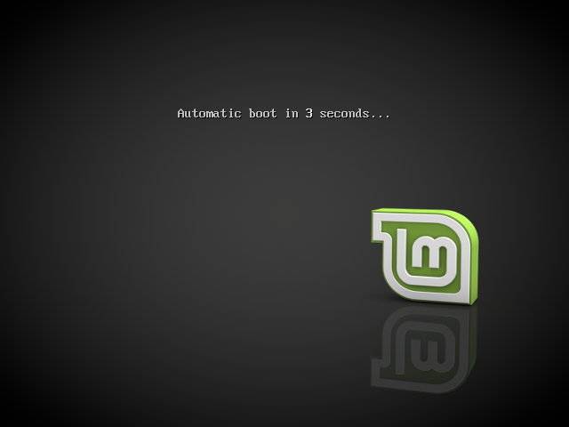
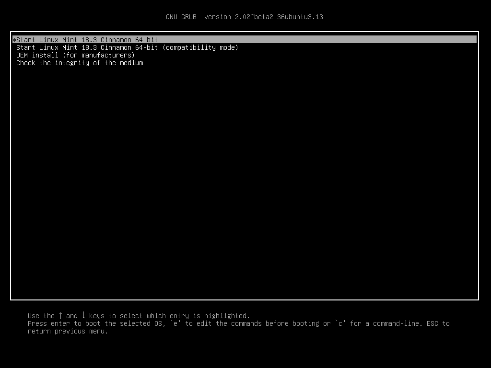

Boot Linux Mint
===============

Now that you have Linux Mint on a USB stick (or DVD) boot the computer from it.

1. Insert your USB stick (or DVD) into the computer.

2. Restart the computer.

3. Before your computer boots your current operating system (Windows, Mac, Linux) you should see your `BIOS <https://en.wikipedia.org/wiki/BIOS>`_ loading screen. Check the screen or your computer's documentation to know which key to press and instruct your computer to boot on USB (or DVD).

.. note::
	Most BIOS have a special key you can press to select the boot device and all of them have a special key to enter the BIOS configuration screen (from which you can define the boot order). Depending on the BIOS, these special keys can be :kbd:`Escape`, :kbd:`F1`, :kbd:`F2`, :kbd:`F8`, :kbd:`F10`, :kbd:`F11`, :kbd:`F12`, or :kbd:`Delete`. That information is usually briefly written on the screen during the boot sequence.

.. hint::
	On Macs, key your finger pressed on the :kbd:`Alt` or :kbd:`Option` key after hearing the boot sound.

4. The Linux Mint ISO can be booted both in EFI or BIOS mode. In EFI mode it shows a grub menu. In BIOS mode it shows an isolinux menu.

    The isolinux menu in BIOS mode

    The grub menu in EFI mode

5. From one of these menu, press :kbd:`Enter` to start Linux Mint from your USB stick (or DVD).