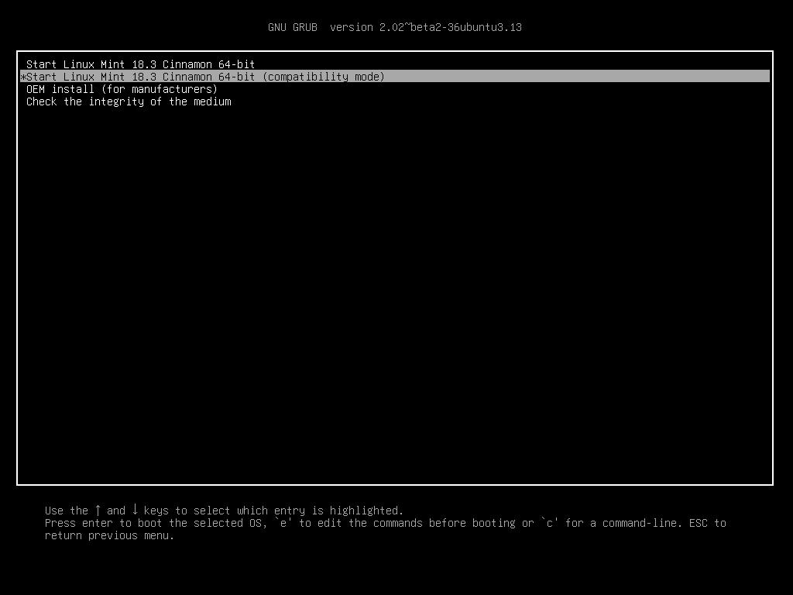
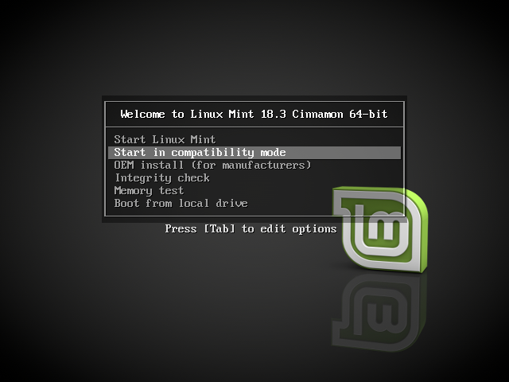
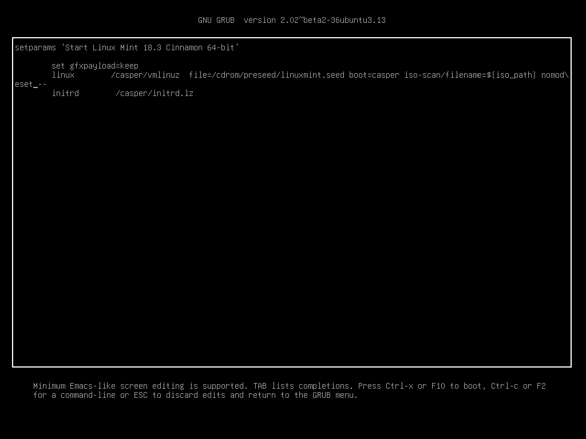
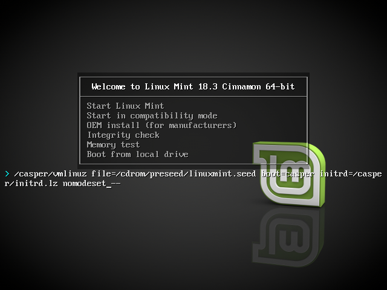

Boot options
============

Some graphics cards and motherboards don't work well with the open-source drivers present in Linux Mint by default.

Compatibility mode
------------------

The easiest option is to select the ``compatibility mode`` option from the USB stick (or DVD) boot menu.

    Grub menu (EFI mode)

    Isolinux menu (BIOS mode)

If that doesn't work, you can try the ``nomodeset`` boot option.

Nomodeset boot option
---------------------

In EFI mode, highlight the ``Start Linux Mint`` option and press :kbd:`e` to modify the boot options.

Replace ``quiet splash`` with ``nomodeset`` and press :kbd:`F10` to boot.

In BIOS mode, highlight ``Start Linux Mint`` and press :kbd:`Tab` to modify the boot options.

Replace ``quiet splash`` with ``nomodeset`` and press :kbd:`Enter` to boot.

Repeat this operation post-install in your grub boot menu and read :doc:`drivers` to install additional drivers.

Other boot options
------------------

If you still cannot boot try one of the following solutions:

* Try ``nouveau.noaccel=1`` instead of ``nomodeset``.
* After the installation, use :menuselection:`Advanced Options --> Recovery mode` from the boot menu and choose ``resume``.

Booting an older kernel
-----------------------

If your computer has issues with the kernel used by a particular Linux Mint release, an easy option is to install a previous release from the same Linux Mint series instead.

For instance, Linux Mint 18.3 comes with a 4.10 kernel but Linux Mint 18 comes with a 4.4 kernel.

It is very easy to upgrade Linux Mint to newer releases, so if for some reasons your hardware doesn't agree with the newest kernel, download and install the first release in the series (i.e. Linux Mint 18 instead of 18.3) and upgrade to the latest release post-installation.

.. note::
    The first release in each series uses an LTS (Long Term Support) kernel. Upgrading from this release to the latest one in the series does not change the Linux kernel.
