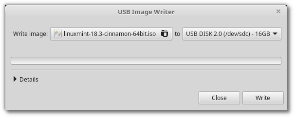
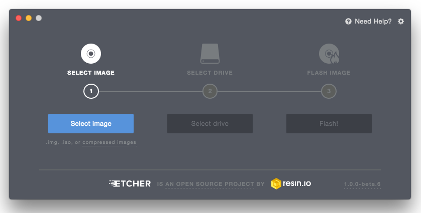

Create the bootable media
=========================

The easiest way to install Linux Mint is with a USB stick.

If you cannot boot from USB, you can use a blank DVD.

How to make a bootable USB stick
--------------------------------

In Linux Mint
`````````````

Right-click the ISO file and select :menuselection:`Make Bootable USB Stick`, or launch :menuselection:`Menu --> Accessories --> USB Image Writer`.



Select your USB device and click :guilabel:`Write`.

In Windows, Mac OS, or other Linux distributions
````````````````````````````````````````````````

Download `Etcher <https://etcher.io/>`_, install it and run it.



    Using Etcher

Click :guilabel:`Select image` and select your ISO file.

Click :guilabel:`Select drive` and select your USB stick.

Click :guilabel:`Flash!`.


How to make a bootable DVD
--------------------------

Optical discs are slow and burning to disc is prone to errors.

.. note::
	To prevent issues, burn at the lowest possible speed.

.. warning::
	Burn the content of the ISO onto the DVD, not the ISO file itself. When finished, your DVD should contain directories such as ``boot`` and ``casper``, it shouldn't be an empty DVD containing an .iso file.

In Linux
````````
Install and use ``xfburn``.

In Windows
``````````
Right-click the ISO file and select :menuselection:`Burn disk image`.

To make sure the ISO was burned without any errors, select :menuselection:`Verify disc after burning`.

In Mac OS
`````````
Right-click the ISO file and select :menuselection:`Burn Disk Image to Disc`.
