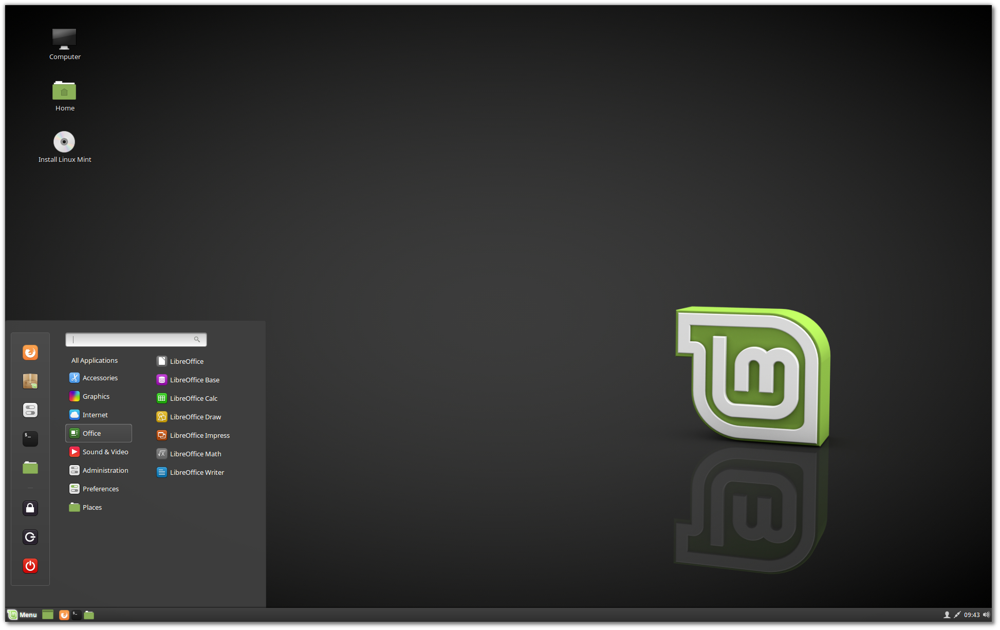
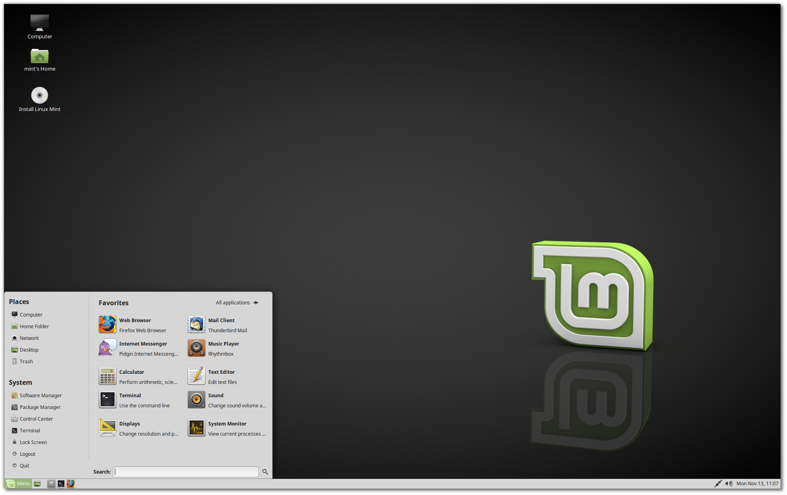
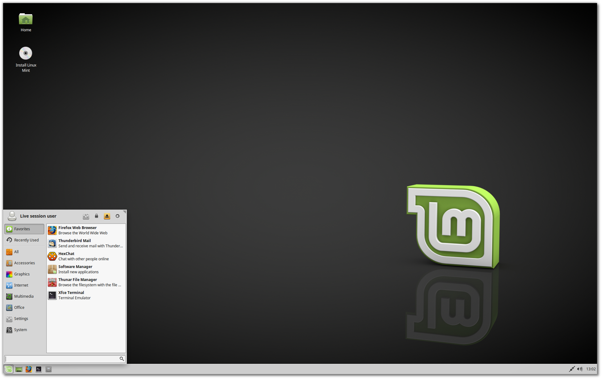

Choose the right edition
========================

You can download Linux Mint from https://linuxmint.com/download.php.

Read below to help you choose which edition and architecture are right for you.

Cinnamon, MATE or Xfce?
-----------------------

Linux Mint comes in 3 different flavours, each featuring a different desktop environment.

========  =====================================================
Cinnamon  The most modern, innovative and full-featured desktop
MATE      A more stable, and faster desktop
Xfce      The most lightweight and the most stable
========  =====================================================

The most popular version of Linux Mint is the Cinnamon edition. Cinnamon is primarily developed for and by Linux Mint. It is slick, beautiful, and full of new features.

    Cinnamon

Linux Mint is also involved in the development of MATE, a classic desktop environment which is the continuation of GNOME 2, Linux Mint's default desktop between 2006 and 2011. Although it misses a few features and its development is slower than Cinnamon's, MATE runs faster, uses less resources and is more stable than Cinnamon.

    MATE

Xfce is a lightweight desktop environment. It doesn't support as many features as Cinnamon or MATE, but it's extremely stable and very light on resource usage.

    Xfce

Of course, all three desktops are great and Linux Mint is extremely proud of each edition. Although there are more features and better support in some editions than others, and some do run faster and use less resources than others, they're all great alternatives and choosing the right edition for you is largely a matter of taste.

Other than their features and performance, Cinnamon, MATE and Xfce also represent three different desktop environments, with different menus, different panels and configuration tools. The right one for you is the one where you feel at home.

If you are unsure which desktop to choose, we recommend you start with the Cinnamon edition. Try them all eventually when you have the time. All three of them have their own audience within the Linux Mint community and they're all very popular.

32-bit or 64-bit?
-----------------

We encourage everyone to run Linux Mint in 64-bit.

The 32-bit ISO images are provided for compatibility with older computers. 32-bit processors are extremely rare nowadays and most computers are able to run in 64-bit. If your computer was manufactured after 2007, you probably have a 64-bit processor.

If you have an old computer and you are unsure whether or not it can run in 64-bit, please check the following table:

https://en.wikipedia.org/wiki/X86#Chronology

.. tip::
    You can try to boot Linux Mint 64-bit on your computer. If it isn't compatible, nothing bad will happen. You will simply get an error message.

.. note::
    Because 64-bit processors can run both in 64-bit and in 32-bit, it is possible to run Linux Mint 32-bit on a 64-bit processor. However this is not recommended, as it will limit the amount of detected RAM to a maximum of 4GB and it can have a negative impact on the performance of your operating system.

