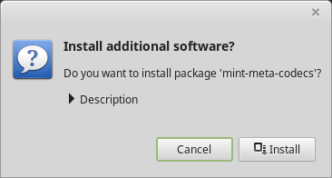

Multimedia codecs
=================

Some multimedia content requires additional codecs to be installed.

.. note::
    If you were online when installing Linux Mint and you ticked the option to install these codecs, they are already installed.

To install these codecs:

1. Launch :menuselection:`Menu --> Sound & Video --> Install Multimedia Codecs`.

2. Click :guilabel:`Install`.

3. Enter your password and wait for the codecs to be installed on your computer.
