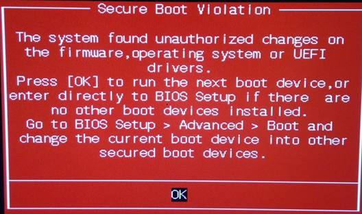
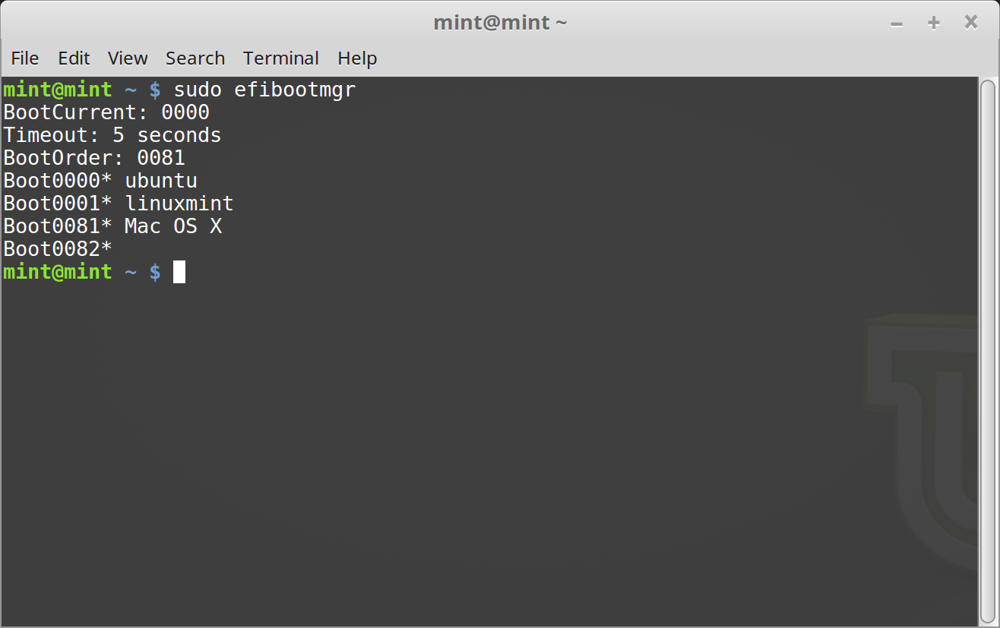
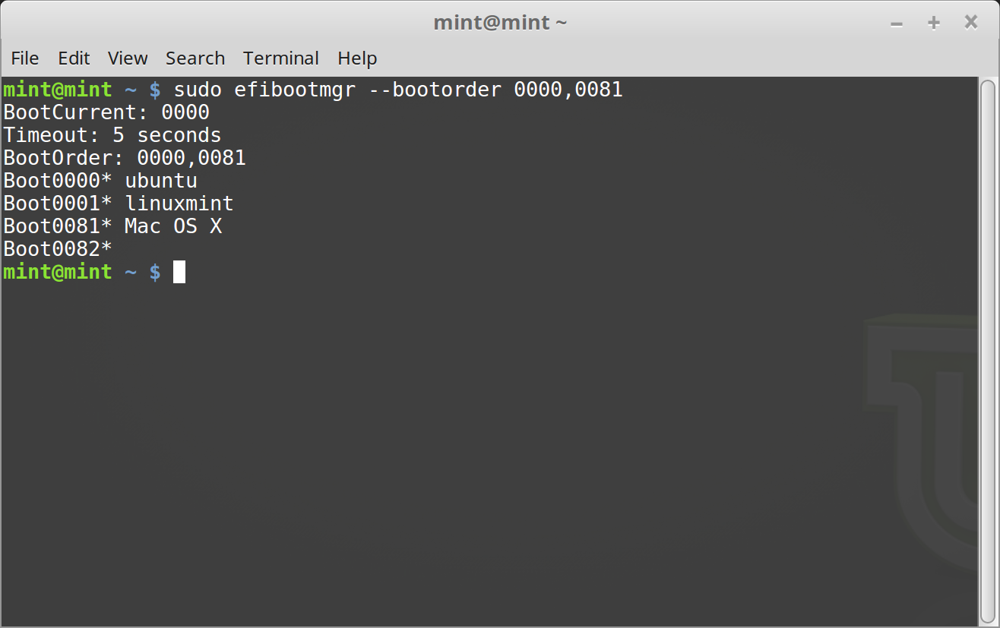

EFI
===

SecureBoot
----------

If after installing Linux Mint in EFI mode, you are unable to boot due to a ``Secure Boot Violation``, you can try one of the following solutions:

* Restart the installation:
    * Make sure to connect to the Internet before the installation
    * **Do not** tick the ``Install third-party software for graphics and Wi-Fi hardware, Flash, MP3 and other media`` checkbox.

* Go in the ``BIOS`` settings and disable ``Secureboot``.

EFI Boot Order
--------------

If after installing Linux Mint in EFI mode, your computer skips the boot menu and boots straight into Windows (or another operating system), you probably have an issue with the boot order.

To modify the boot order:

1. Boot Linux Mint in ``live`` mode (with your USB stick or DVD).

2. Open a terminal.

3. Type ``sudo efibootmgr`` to see the boot order.

This command lists the available boot options and the boot order.

In the example above, we can see three boot options:

* ``ubuntu`` at ``0000``
* ``linuxmint`` at ``0001``
* ``Mac OS X`` at ``0081``

The boot order is ``0081``. This indicates that the computer only tries to boot Mac OS and not Linux Mint.

.. important::
    For technical reasons Linux Mint uses ``ubuntu`` as its EFI boot name.

4. To fix the boot order, type ``sudo efibootmgr --bootorder XXXX,YYYY`` (where ``XXXX`` and ``YYYY`` represent the operating system boot options you want to boot).

In the example above, we typed ``sudo efibootmgr --bootorder 0000,0081``, to instruct the computer to first try to boot Linux Mint (``ubuntu`` being the EFI boot name for Linux Mint), and then Mac OS.

5. Restart the computer.

.. note::
    In our example ``0000`` is the first boot option so the computer boots on the Linux Mint grub menu. If we decide to quit the grub menu by typing ``exit``, the computer falls back to the second boot option in its boot order and consequently boots ``0081``, which corresponds to Mac Os.