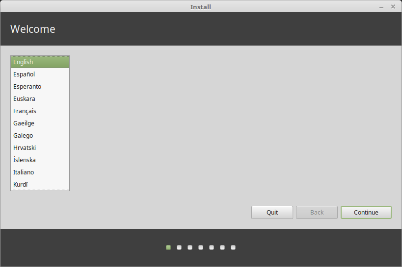
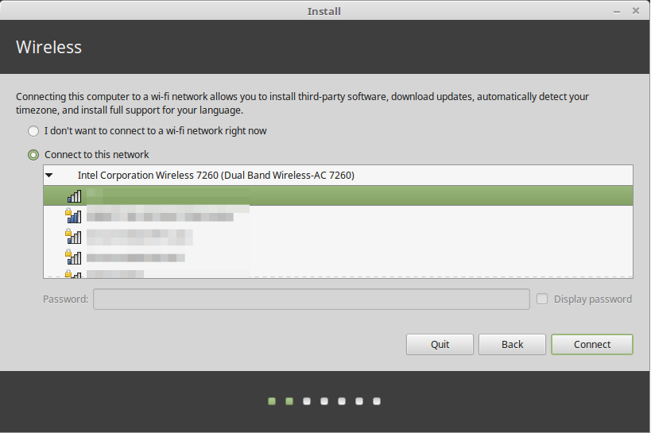
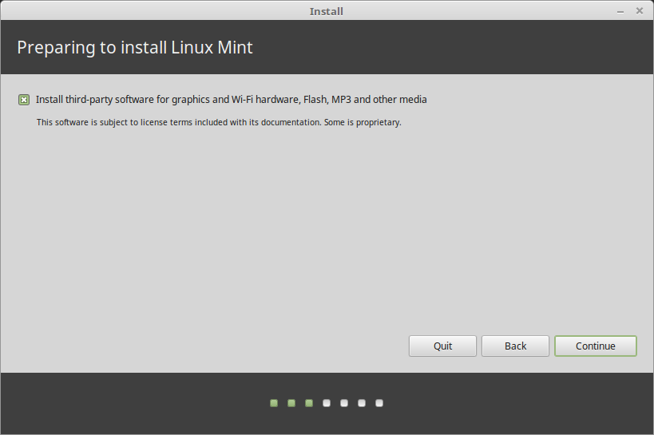
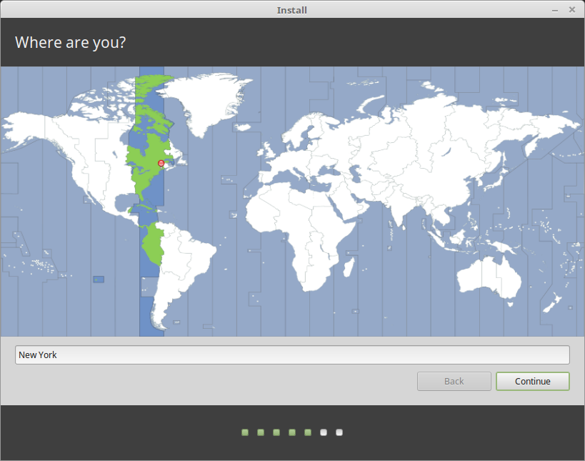
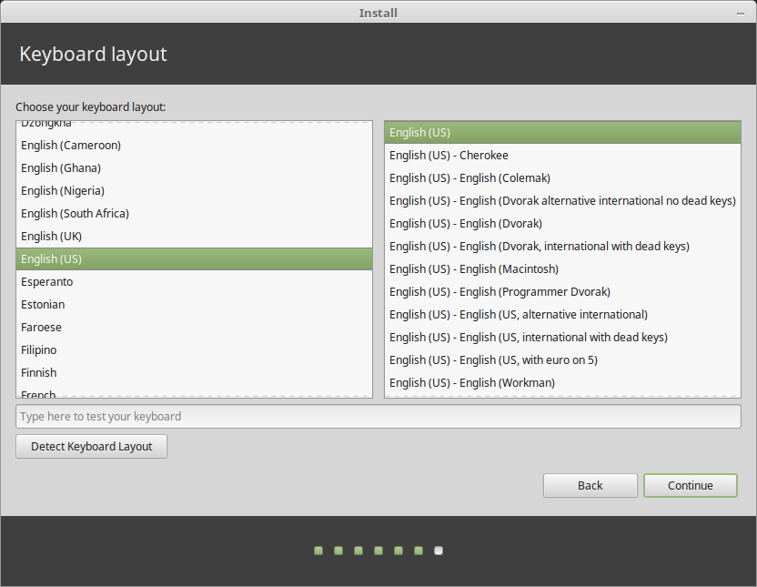
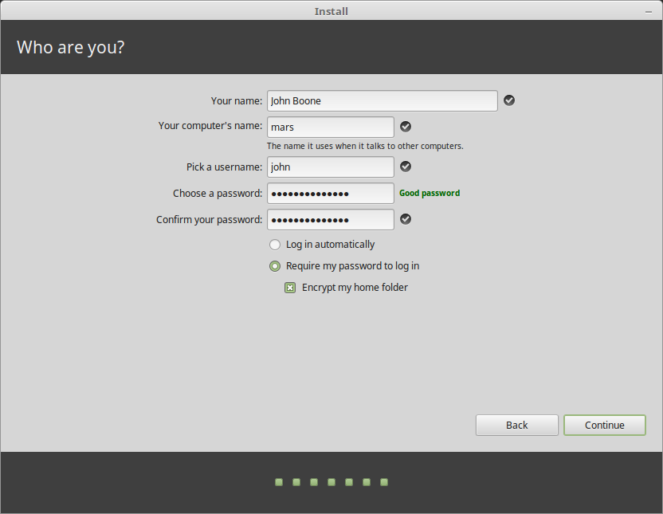
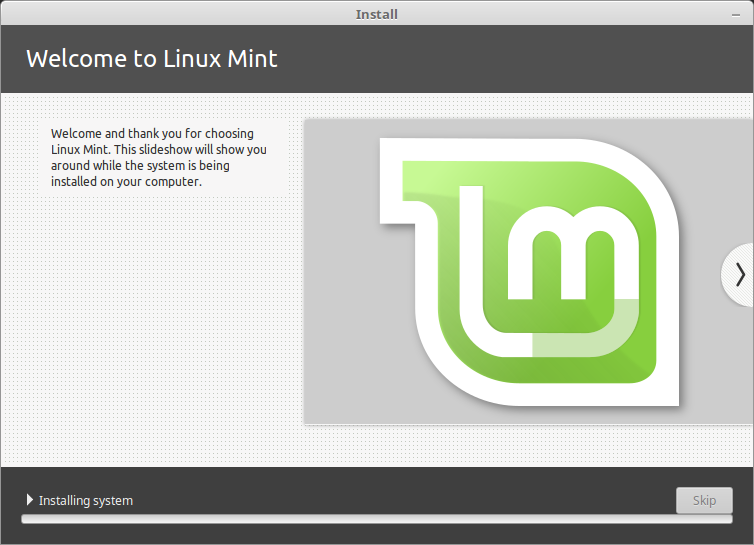
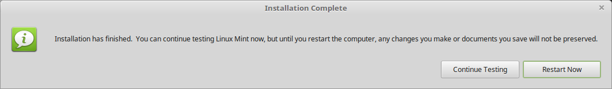

Install Linux Mint
==================

Booting the Live Session
------------------------

After you boot the computer from the USB stick (or DVD), Linux Mint should start a ``Live Session``, i.e. log you in automatically as a user called ``mint`` and show you a desktop with the installer on it:

.. figure:: images/cinnamon.png
    :width: 500px
    :align: center

    The Linux Mint ``Live Session``

The ``Live Session`` is very similar to a normal session (i.e. to what Linux Mint is like once it is permanently installed on the computer), but with the following exceptions:

* The Live session is usually much slower (it runs in memory and from a USB stick or DVD, which are usually much slower than typical SSD/HDD drives)
* Changes you make in the live session are not permanent, they only affect the present session. These changes are not written to the USB stick (or DVD) and they do not impact the system installed by the installer.
* Due to technical limitations and/or design, some software either doesn't work or works differently in live sessions (Timeshift, Flatpak, Update Manager, Welcome Screen..etc.)

.. hint::
    The username for the live session is ``mint`` and the password is blank (i.e. there is no password, if asked for a password just press :kbd:`Enter`)

Installing Linux Mint on the computer
-------------------------------------

To permanently install Linux Mint on your computer (to your SSD or HDD drive):

1. Launch the installer by double-clicking the :guilabel:`Install Linux Mint` icon.

2. Select your language.

3. Connect to the Internet.

This step is optional but it saves time post-installation. It allows the installer to download language support packages and multimedia codecs.

4. If you are connected to the Internet, tick the box to install the multimedia codecs.

5. Choose an installation type.

.. figure:: images/installer-install.png
    :width: 500px
    :align: center

If Linux Mint is the only operating system you want to run on this computer and all data can be lost on the hard drive, choose :guilabel:`Erase disk and install Linux Mint`.

.. warning::
    :guilabel:`Encrypt the new Linux Mint installation for security` refers to full disk encryption. At this stage of the installation your keyboard layout wasn't yet selected so it is set to en_US. Please keep this in mind when entering a password if you decide to use this option. Note that there are also issues with this option and some NVIDIA drivers. If you are new to Linux, we recommend using home directory encryption instead (which you can select later during the installation).

If another operating system is present on the computer, the installer will show you an option to install Linux Mint alongside it. If you choose this option, the installer will automatically resize your existing operating system, make room and install Linux Mint beside it and set up a boot menu so you can choose between the two operating systems each time you start your computer.

.. note::

    If you want to manage the partitions yourself or manually specify which partitions to use, select the :guilabel:`Something else` option.

    .. figure:: images/installer-partitions.png
        :width: 500px
        :align: center

    At the very least, Linux Mint requires one partition to be mounted on the root ``/`` directory.

    A small Linux Mint system (without counting additional software and personal data) takes roughly 15GB, so give this partition a decent size (100GB or more).

    We recommend you use the ``ext4`` filesystem type (it is the most popular among Linux users).

    .. figure:: images/installer-partition.png
        :align: center

    You should also have a ``swap`` partition. This partition is used for hibernation and as a safety buffer in case your computer runs out of RAM. You can give this partition a size equal to the amount of RAM in your computer.

6. Select your timezone

7. Select your keyboard layout

8. Enter your user details

Your ``name`` can be your real name, but it doesn't have to be. It will appear in your screensaver by default and on your login screen. It's only used locally.

Your ``username`` is what you log in as, and your ``hostname`` is the name of your computer on the network.

To prevent bugs only use lowercase characters, with no punctuation or accentuation when entering these.

If you want to protect your personal data against local attacks (people around you, or in case your computer gets stolen), tick :guilabel:`Encrypt my home folder`.

For the same reason, choose a strong password.

9. Enjoy the slideshow while Linux Mint is installed on your computer

When the installation is finished, click :guilabel:`Restart Now`.

The computer will then start to shut down and ask you to remove the USB disk (or DVD). Upon reboot, your computer should show you a boot menu or start your newly installed Linux Mint operating system.
