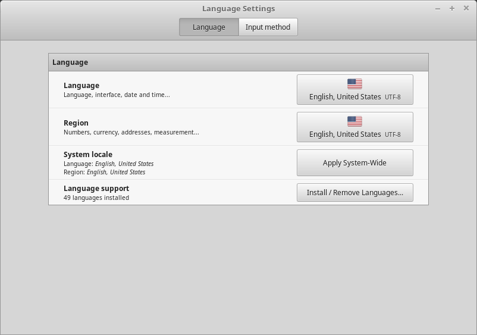
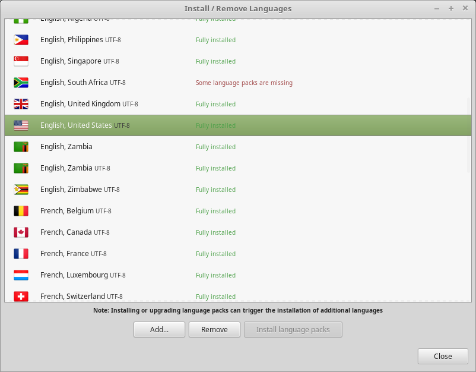

Language Support
================

Language support includes translations but also packages related to spell-checking, synonyms, hyphenation and dictionnaries which enhance your experience in software applications such as LibreOffice.

.. note::
	Depending on your locale and whether or not you were online during the installation, some of these packages might already be installed.

1. Launch the language settings by opening :menuselection:`Menu --> Preferences --> Languages`.

2. Click on :guilabel:`Install / Remove Language`.

3. If beside your locale, you see a label saying ``Some language packs are missing``, select your locale and click on :guilabel:`Install language packs`.

