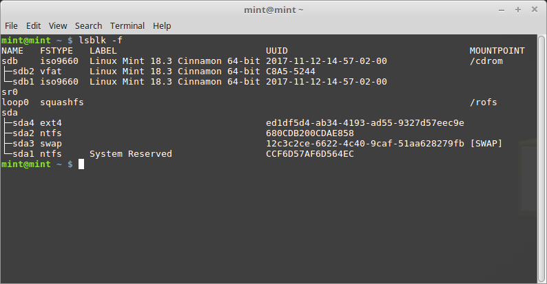
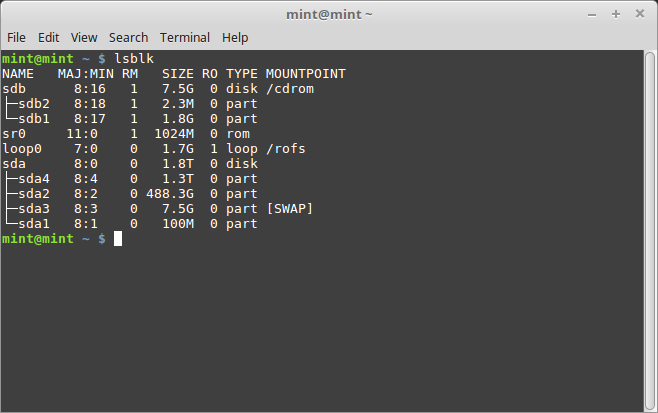
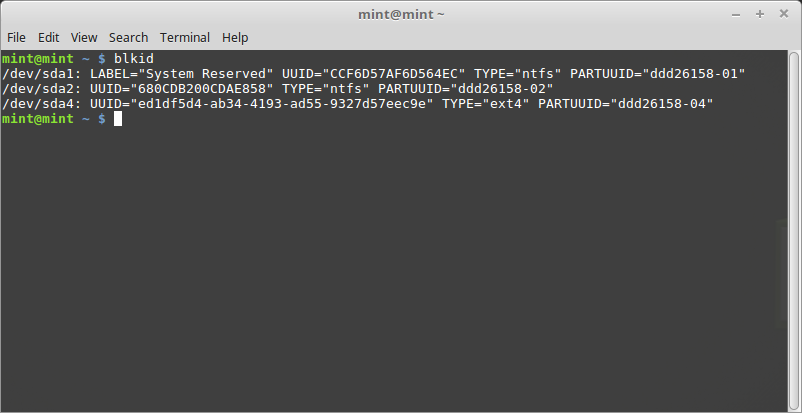

Multi-boot
==========

Always install Windows first
----------------------------

Windows does not detect other operating systems and does not feature a boot menu. When you install it, it overwrites your boot sequence and your computer then boots straight into Windows.

Linux Mint (and most Linux distributions) detects other operating systems and builds a menu from which you can choose which system to boot.

For this reason, if you want to dual-boot or multi-boot with Windows, it is easier and recommended to install Windows first, before you install Linux Mint.

Fix the boot sequence
---------------------

If Windows overwrites your boot sequence, do the following to fix it:

1. Boot Linux Mint in ``live`` mode (with your USB stick or DVD).

2. Open a terminal.

3. Type ``lsblk -f`` to list your partitions and find the partition where Linux Mint is installed.

On most systems this should be the only ``ext4`` partition.

In the example above:

* ``sdb`` is the USB stick itself (recognizable by its ``iso9660`` type which corresponds to an ISO image).
* ``sda`` is our hard drive.
* ``sda4`` is the partition on the ``sda`` hard drive, where Linux Mint is installed.

If you need more information about your partitions you can type ``lsblk`` to list the partition sizes:

You can also type ``blkid`` to show more information (sometimes this command shows partition labels which aren't visible with ``lsblk``):

3. Mount the partition and reinstall the grub menu with the following commands:

.. code-block:: console

    sudo mount /dev/sda4 /mnt
    sudo grub-install --root-directory=/mnt /dev/sda

.. warning::
	In the commands above, make sure to replace /dev/sda4 and /dev/sda with the appropriate names for your Linux Mint partition and your hard drive device.
