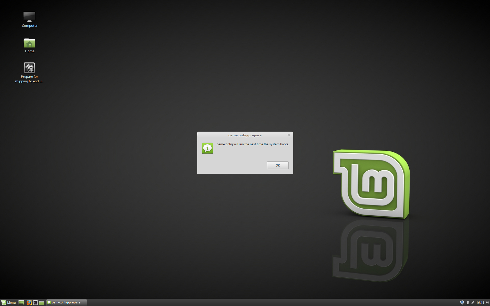
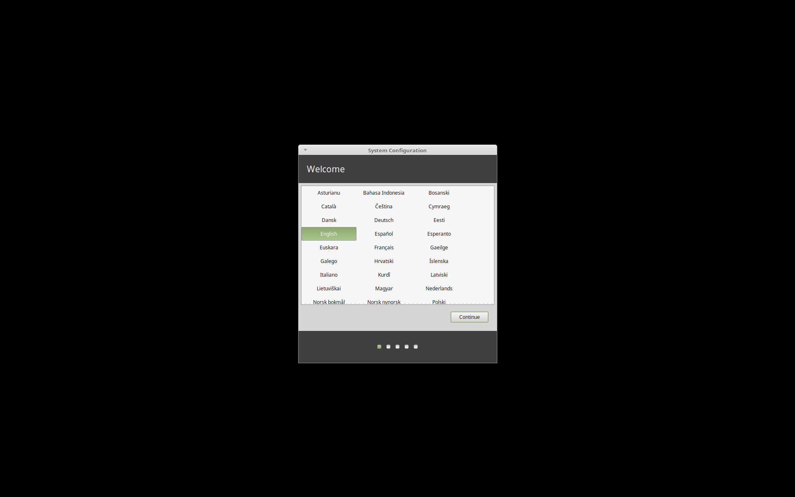

Pre-installing Linux Mint (OEM Installation)
============================================

The ``OEM install`` option in the ISO boot menu is used to preinstall Linux Mint.

This option is useful to:

* Manufacturers and resellers who want to install Linux Mint on computers they sell to their customers.
* People who want to sell, refurbish or give their computer to somebody else.

When you install Linux Mint in ``OEM`` mode, the installer installs the operating system on the computer but does not set up the user account.

This final step is performed by the customer (or the new owner of the computer) when the computer is booted, after the purchase (or gift), for the first time.

To perform an OEM installation follow the steps below:

1. Select the ``OEM Install`` option from the USB stick (or DVD) menu.

2. Launch the installer and follow the installation instructions.

3. Reboot the computer.

4. Change any system settings or install additional software if you want.

5. When the system is ready, click :guilabel:`Prepare for shipping to end user`, enter the password you chose during the installation, click :guilabel:`OK` and shut down the computer.

When the new owner of the computer boots the computer the following screen will appear to create the user account:

The new owner will get the opportunity to select his/her username, password, keyboard layout, language, timezone and all the details relevant to create his/her user account.
