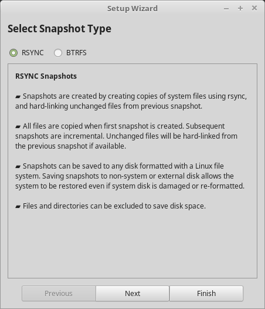
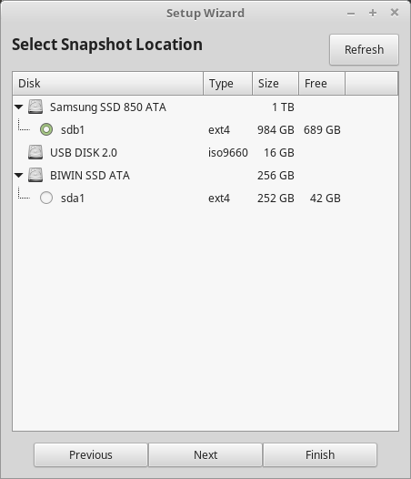
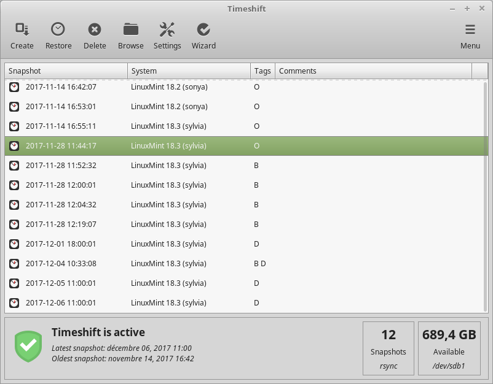

System Snapshots
================

Before you start using your operating system, we recommend you set up system snapshots. That way if anything goes wrong, you can simply restore your system from an earlier backup.

1. To set up system snapshots, launch :menuselection:`Menu --> Administration --> Timeshift`.

2. Select ``RSYNC`` (unless you chose ``btrfs`` instead of ``ext4`` for your filesystem during the installation) and click :guilabel:`Next`.

3. Select the device where you want system snapshots to be saved and click :guilabel:`Next`.

.. note::
    This does not format the select device. No data is lost during this step. System snapshots are saved into a newly created ``timeshift`` directory on the root of the selected device.

4. Select when system snapshots are saved.

.. figure:: images/timeshift-3.png
    :align: center

.. note::
    System snapshots are incremental so although the first snapshot takes a significant amount of spaces, new snapshots only take additional space for files which have changed.

.. note::
    Although ``boot`` snapshots are performed during the boot, they happen in the background and with a delay. They do not impact the speed of the boot sequence.

5. Click :guilabel:`Finish`.

